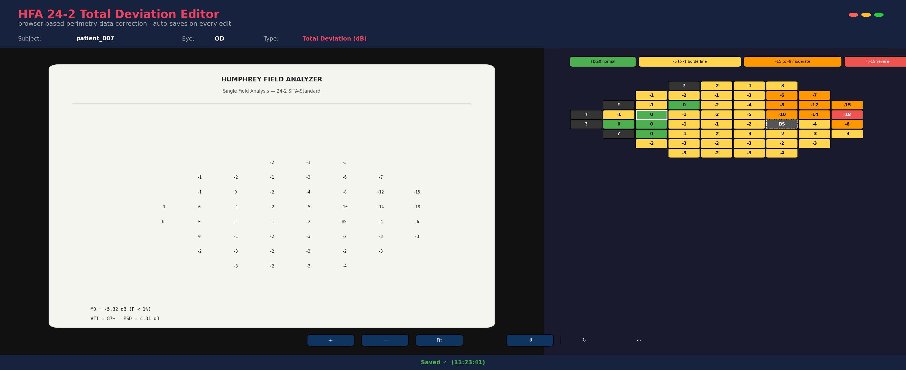
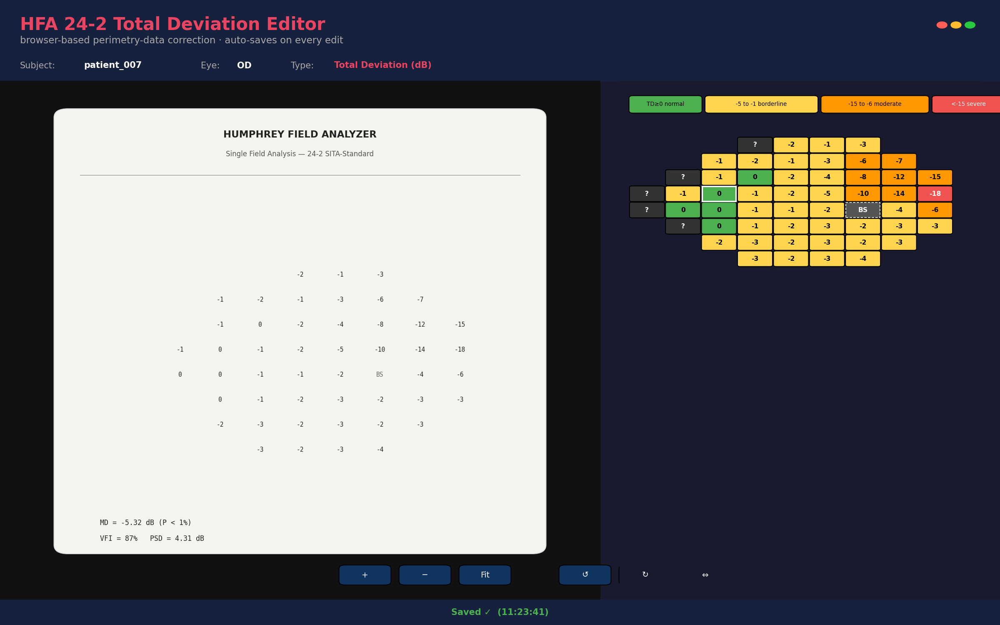
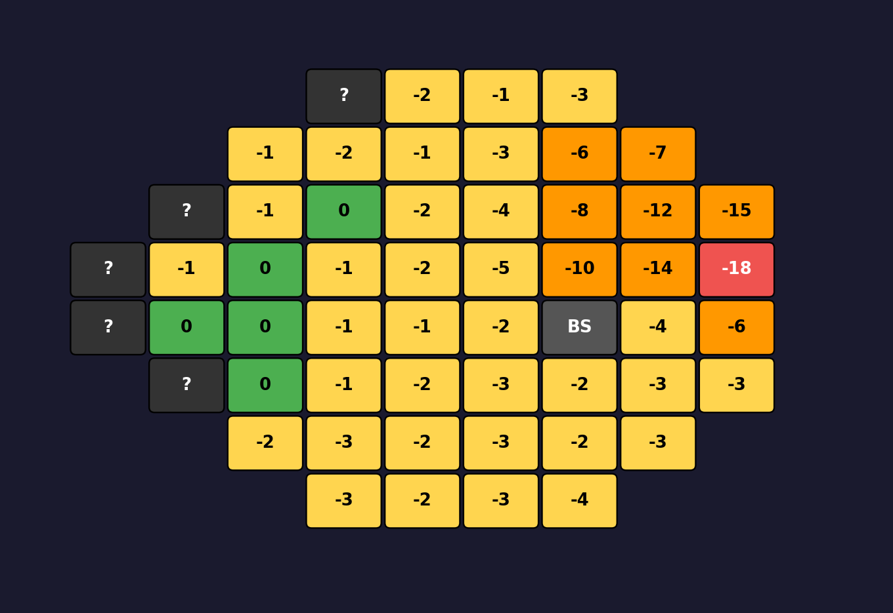

<div align="center">



# Perimetry Editor

**Browser-based corrector for Humphrey 24-2 Total-Deviation perimetry data.**
Click the doctor's report on the left, fix the OCR-extracted numbers on the right.
Every edit auto-saves to a clean CSV. Zero dependencies.

[](https://www.python.org)
[](#tech-stack)
[](#deploy)
[](#license)
[](https://render.com/deploy?repo=https://github.com/Ziqi-Hao/Perimetry-Editor)

</div>

---

## ✨ Why this exists

OCR pipelines on HFA single-field reports almost work — they get 90 % of the
54 Total Deviation numbers right, but blind spots, low-contrast cells, and
diagonal `BS` markers slip through. **Re-typing 16 corrected values into a
spreadsheet, eye-balling them against the original report, is the slow,
error-prone bottleneck.** This tool makes that step take ~30 s per eye
instead of ~10 min.

|  |  |
| :--- | :--- |
| 🔍&nbsp; **Side-by-side** | Zoomable Humphrey report on the left, editable colour-coded 24-2 grid on the right. |
| 💾&nbsp; **Auto-save** | Every keystroke writes `td_54point.csv` + `td_grids.json`. No "Save" button to forget. |
| ⬆️&nbsp; **Drop-in upload** | Add subjects from the UI — works for any cohort, not just the original project's. |
| 🎨&nbsp; **Severity colours** | Cells colour-code as you type: green / yellow / orange / red mirror typical clinical severity bands. |
| 🐳&nbsp; **One-click deploy** | Render, Fly.io, Railway, or any Docker host. Persistent volume, no database. |
| 🪶&nbsp; **Python stdlib only** | `pip install` is empty. The whole backend is ~400 lines of `http.server`. |

---

## 🚀 Quick start

```bash
git clone https://github.com/Ziqi-Hao/Perimetry-Editor.git
cd Perimetry-Editor
python3 app/server.py
# → http://localhost:8766
```

Then click **+ Upload report**, drop in any `{subject}_{OD|OS}.jpg` (or
`.png`), and start correcting.

**Or one-click deploy** to a free Render instance:

[](https://render.com/deploy?repo=https://github.com/Ziqi-Hao/Perimetry-Editor)

---

## 📷 What it looks like

<div align="center">



*Left: stylised Humphrey report. Right: live editable 24-2 grid. Colour
bands at the top, status bar at the bottom confirms each auto-save.*

</div>

### The grid alone

<div align="center">



</div>

| Colour | Meaning |
| :-: | :-- |
| 🟢 green | TD ≥ 0 (normal) |
| 🟡 yellow | −5 to −1 dB (borderline) |
| 🟠 orange | −15 to −6 dB (moderate deficit) |
| 🔴 red | < −15 dB (severe deficit) |
| ⬜ gray | physiological blind spot (`BS`) |
| `?` | missing / not yet entered |

---

## ⌨️ Keyboard

| Key | Action |
| :-- | :-- |
| <kbd>Click</kbd> | Edit a cell |
| <kbd>Enter</kbd> | Confirm value |
| <kbd>Tab</kbd> / <kbd>Shift+Tab</kbd> | Next / previous cell |
| <kbd>Esc</kbd> | Cancel edit |
| <kbd>←</kbd> / <kbd>→</kbd> | Previous / next subject |
| Type `BS` | Mark a cell as blind spot |
| Type `?` or empty | Mark as missing |
| Mouse wheel | Zoom report image |
| Click-drag | Pan report image |

---

## 🏗 Architecture

```mermaid
flowchart LR
  subgraph Browser["🖥 Browser (single HTML page)"]
    UI[Zoomable left pane<br/>+ editable right grid]
  end
  subgraph Server["🐍 server.py · stdlib http.server"]
    GET_DATA["/api/data"]
    GET_IMG["/api/image?key=..."]
    POST_SAVE["/api/autosave"]
    POST_UP["/api/upload"]
    HEALTH["/health"]
  end
  subgraph Disk["💾 $DATA_DIR (Docker volume)"]
    IMG[images/<br/>{subject}_OD.jpg]
    CSV[extracted/<br/>td_54point.csv]
    JSON[extracted/<br/>td_grids.json]
  end

  UI <-->|JSON| GET_DATA
  UI -->|GET| GET_IMG
  GET_IMG --> IMG
  UI -->|POST every edit| POST_SAVE
  POST_SAVE --> CSV
  POST_SAVE --> JSON
  UI -->|multipart| POST_UP
  POST_UP --> IMG
  Server -->|"on startup"| JSON
```

Three moving parts. No database, no JS framework, no build step.

---

## 📤 Output

The CSV is the canonical artifact — point your analysis pipeline at it.

```csv
subject,eye,age,sex,row,col,x_vf_deg,y_vf_deg,eccentricity_deg,quadrant,td_dB
patient_007,OD,,,0,1,-3,21,21.21,ST,-2
patient_007,OD,,,0,2, 3,21,21.21,SN,-1
patient_007,OD,,,4,7,15,-3,15.30,IT,BS
patient_007,OD,,,4,8,21,-3,21.21,IT,-4
...
```

| column | meaning |
| :--- | :--- |
| `x_vf_deg`, `y_vf_deg` | Visual-field coordinates in degrees (positive x = right hemifield) |
| `eccentricity_deg` | `√(x² + y²)` distance from fixation |
| `quadrant` | Anatomical quadrant (`SN`/`ST`/`IN`/`IT`) |
| `td_dB` | Cell value: integer dB, the literal `BS`, or empty if still missing |

---

## ☁️ Deploy

Three free-tier-friendly platforms are pre-templated in [`deploy/`](deploy/).

| Platform | One-click? | Persistent disk | Notes |
| :--- | :-: | :--- | :--- |
| **[Render](https://render.com)** | ✅ blueprint | 1 GB auto-mounted | Cold-starts ~30 s on free tier |
| **[Fly.io](https://fly.io)** | `fly launch` | `fly volumes create` | Pick the region closest to you |
| **[Railway](https://railway.app)** | ✅ from GitHub | Add Volume in dashboard | No free tier as of 2024 |
| **Your own VPS** | `docker run` | `-v $(pwd)/data:/data` | Front with nginx + basic auth |

See [`README.md` → Deployment](#deploy) for the exact commands.

### Render (recommended)

```bash
# 1. push this repo to GitHub (already done if you're reading on GitHub)
# 2. on Render: New + → Blueprint → point at the repo → done
```

Render reads [`deploy/render.yaml`](deploy/render.yaml), builds the Docker
image, attaches the persistent disk, and gives you
`https://<service>.onrender.com`.

### Fly.io (Montreal region default)

```bash
brew install flyctl && fly auth login
cp deploy/fly.toml fly.toml
fly launch --copy-config --no-deploy
fly volumes create hfa_td_editor_data --size 1 --region yul
fly deploy
```

### Plain Docker (any VPS)

```bash
docker build -t perimetry-editor .
docker run -d -p 80:8766 -v $(pwd)/data:/data perimetry-editor
```

---

## 🔒 Security

The tool **has no authentication by default** — it assumes you're either
running it locally or fronting it with a reverse proxy. Before exposing
publicly:

- Add basic auth at the reverse proxy (nginx `auth_basic` / Caddy
  `basicauth` — two lines of config)
- Or use **Cloudflare Access** / **Tailscale Funnel** for SSO
- Cap upload size at the proxy (`client_max_body_size 10M`)
- **Don't put real patient identifiers in the subject ID field.** Use coded
  IDs (`P001`, `glaucoma_007`) and keep the linkage table off the public
  deployment

---

## ⚙️ Configuration

All via environment variables; nothing is hard-coded.

| Var | Default | What it does |
|---|---|---|
| `PORT` | `8766` | HTTP port |
| `HOST` | `0.0.0.0` | Bind host |
| `DATA_DIR` | `./data` | Root of `images/` and `extracted/` |

---

## 🧬 Tech stack

| | |
| :--- | :--- |
| Backend | Python ≥ 3.8 — `http.server`, `email`, `csv`, `json`, `re` (stdlib only) |
| Frontend | Hand-written HTML + vanilla JS (no React, no build step, no node_modules) |
| Persistence | Two files: `td_54point.csv` + `td_grids.json` on a Docker volume |
| Container | `python:3.12-slim` + the app — final image ~50 MB |

The whole backend is **~400 lines of Python**. Read it: [`app/server.py`](app/server.py).

---

## 🗺 Roadmap

- [ ] Optional PDF upload (auto-rasterize at 200 DPI with `pdftoppm`)
- [ ] Pattern Deviation (PD) + sensitivity-threshold modes alongside TD
- [ ] Bulk CSV export of multiple cohorts
- [ ] Side-by-side OS / OD view for the same subject
- [ ] Diff view: original OCR ↔ user-edited values, to highlight corrections
- [ ] Built-in basic auth (so you don't *need* a reverse proxy for personal use)

PRs welcome.

---

## 📜 License

MIT — see [`LICENSE`](LICENSE). The patient images and TD values you upload
stay on your own machine or your own PaaS volume; nothing leaves your
deployment.

---

<div align="center">

Made by [Ziqi Hao](https://github.com/Ziqi-Hao) at the
McConnell Brain Imaging Centre, McGill University.

⭐ **If this saved you an afternoon of re-typing,
[star the repo](https://github.com/Ziqi-Hao/Perimetry-Editor)** — it's the only
thanks the tool needs.

</div>
