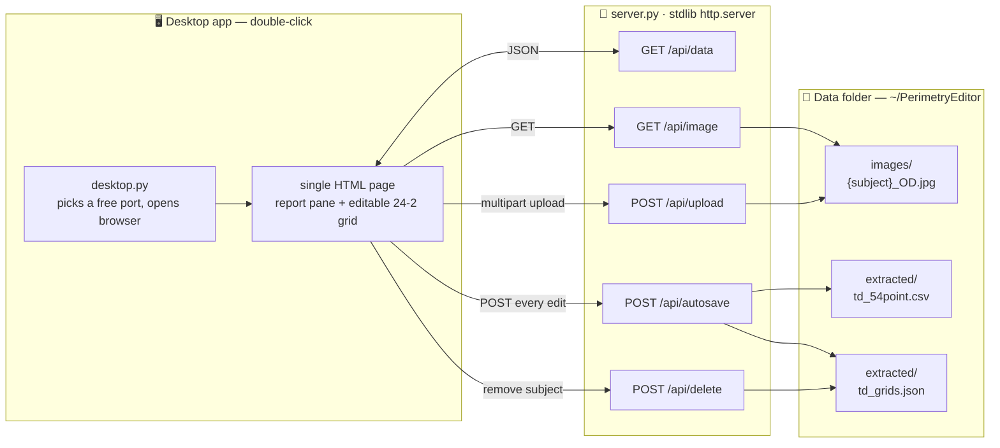

# Perimetry Editor

**A double-click desktop app for correcting Humphrey 24-2 Total-Deviation
perimetry data.** Open the report image on the left, fix the OCR-extracted
numbers on the right — every edit auto-saves to a clean CSV. No install, no
Python, no cloud.

<p align="center">
  
</p>

## Download

Grab the app for your OS from the
[**latest release**](https://github.com/Ziqi-Hao/Perimetry-Editor/releases/latest)
and double-click it:

| OS | File | First launch |
| :-- | :-- | :-- |
| **Windows** | `PerimetryEditor-Windows.exe` | SmartScreen → **More info → Run anyway** |
| **macOS** (Apple Silicon) | `PerimetryEditor-macOS-AppleSilicon` | **Right-click → Open** (unsigned) |
| **Linux** | `PerimetryEditor-Linux` | `chmod +x PerimetryEditor-Linux`, then run |

It opens in your browser and saves everything to a `PerimetryEditor/` folder in
your home directory. Click **📁 Data folder** in the app to find your CSV.
A small console window stays open while it runs — close it to quit.

> Runs entirely on your machine — nothing is uploaded. Use coded subject IDs,
> not patient names.

## Run from source

```bash
git clone https://github.com/Ziqi-Hao/Perimetry-Editor.git
cd Perimetry-Editor
python3 app/desktop.py        # opens your browser automatically
```

Pure Python standard library — no `pip install` needed.
(`python3 app/server.py` runs it as a plain server on `:8766`.)

## Using it

Upload a report, then fill the 54-point grid. It's keyboard-first:

| Key | Action |
| :-- | :-- |
| Click / start typing | Edit the focused cell |
| <kbd>Enter</kbd> / <kbd>Tab</kbd> | Save + next cell |
| <kbd>↑</kbd> <kbd>↓</kbd> | Save + move up / down |
| <kbd>Esc</kbd> | Cancel the edit |
| <kbd>←</kbd> <kbd>→</kbd> | Previous / next subject |
| Type `BS` / `B` | Blind spot · `?` or empty = missing |

Cells colour-code by severity as you type: green ≥ 0, yellow −5…−1,
orange −15…−6, red < −15.

## Output

Every edit writes `extracted/td_54point.csv` (and `td_grids.json`) into your
data folder. The CSV is the canonical artifact — one row per tested point:

| column | meaning |
| :-- | :-- |
| `subject`, `eye`, `age`, `sex` | subject metadata |
| `row`, `col` | grid position |
| `x_vf_deg`, `y_vf_deg` | visual-field coordinates (degrees) |
| `eccentricity_deg` | distance from fixation |
| `quadrant` | anatomical quadrant (`SN`/`ST`/`IN`/`IT`) |
| `td_dB` | value in dB, the literal `BS`, or empty |

## How it works



Three small files, no database, no framework, no build step:

- `app/desktop.py` — launcher: picks a port, opens the browser, keeps data in `~/PerimetryEditor`
- `app/server.py` — `http.server` backend **plus the entire UI** (HTML/CSS/JS embedded)
- `app/hvf_24_2.py` — 24-2 grid geometry

## Build the executables

```bash
pip install -r requirements-dev.txt   # PyInstaller (build tooling only)
./build.sh                            # → dist/PerimetryEditor
```

Pushing a version tag (`git tag v1.0.4 && git push origin v1.0.4`) builds
Windows / macOS / Linux binaries via GitHub Actions, smoke-tests each one, and
publishes them to a release — see
[`.github/workflows/build.yml`](.github/workflows/build.yml).

## License

MIT — see [`LICENSE`](LICENSE). Made at the McConnell Brain Imaging Centre,
McGill University.
